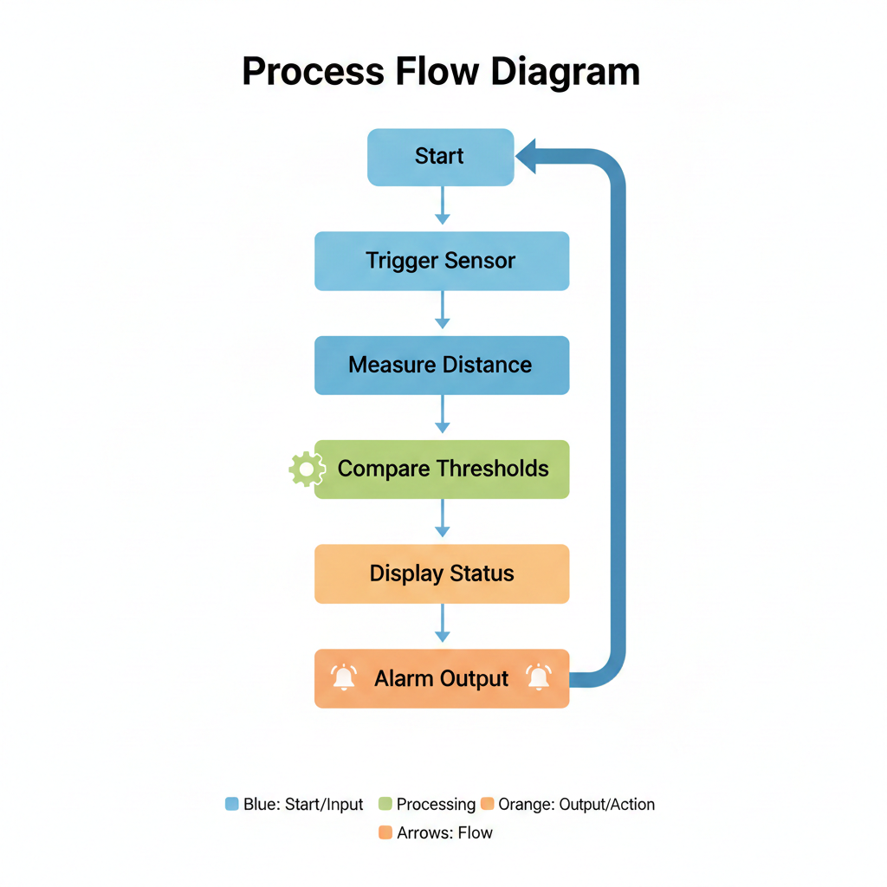
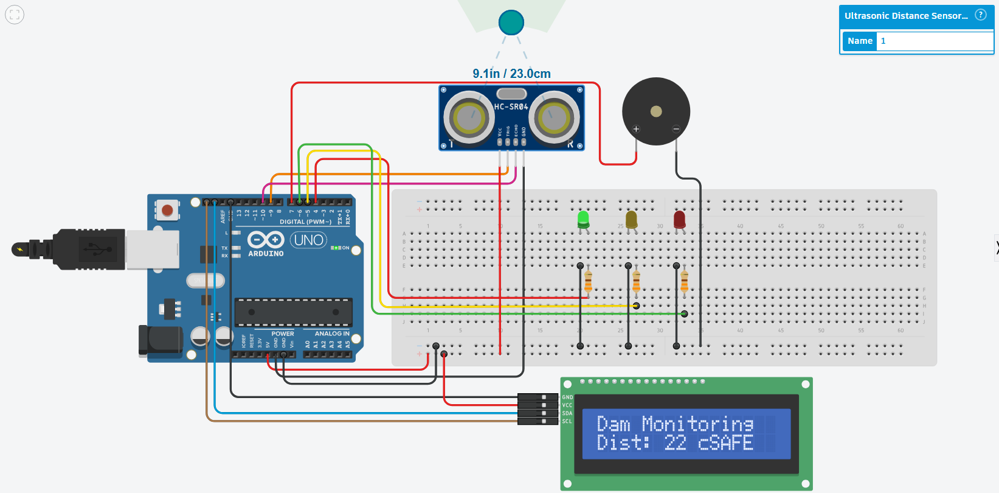
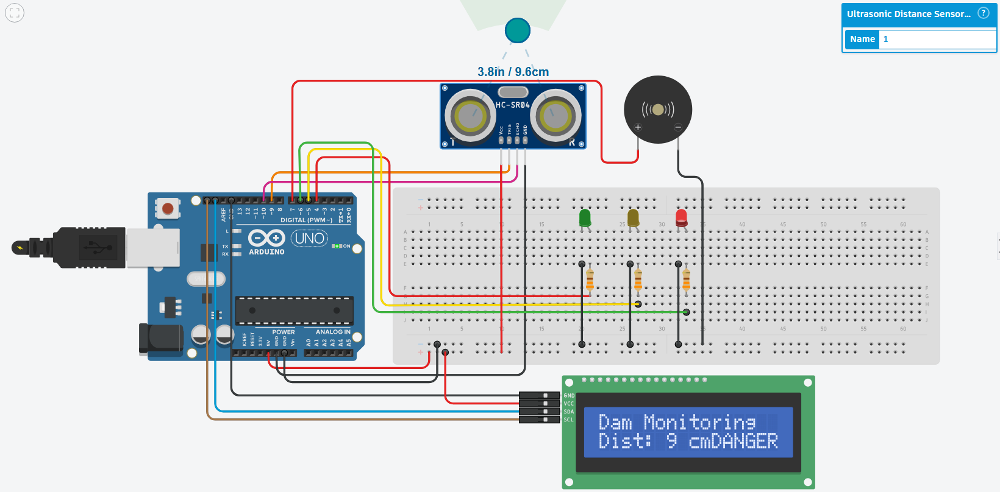

# Dam Water Level Monitoring System using Ultrasonic Sensor

An automated **Dam Water Level Monitoring System** built using an **Arduino Uno** and an **HC-SR04 ultrasonic sensor** to continuously monitor water levels and provide real-time alerts during warning and danger conditions.

---

## Aim
To design and implement a non-contact water level monitoring system for dams that improves safety through early flood warning alerts.

---

## Objectives
- Monitor water level without physical contact  
- Display real-time distance and status on an LCD  
- Provide visual alerts using LEDs  
- Generate audible alerts for warning and danger levels  
- Enhance dam safety and early warning mechanisms  

---

## Components Used
- Arduino Uno  
- Ultrasonic Sensor (HC-SR04)  
- I2C LCD Display (16×2)  
- Green, Yellow, Red LEDs  
- Buzzer  
- 330Ω Resistors  
- Connecting Wires  
- Power Supply  

---

## Working Principle
The ultrasonic sensor emits sound waves toward the water surface. The reflected echo is received by the sensor, and the time taken is converted into distance using the speed of sound. Based on predefined threshold values, the system determines the water level condition and triggers alerts accordingly.

---

## System Operation

| Condition | Distance | Indication |
|-----------|----------|------------|
| Safe      | > 20 cm  | Green LED ON, Buzzer OFF |
| Warning   | 10–20 cm | Yellow LED ON, Buzzer for 3 seconds |
| Danger    | ≤ 10 cm  | Red LED ON, Continuous Buzzer |

---

## Block Diagram

---

## Flowchart

---

## Circuit Connections

### Safe Condition

### Warning Condition

### Danger Condition

---

## Pin Configuration

| Component | Arduino Pin |
|-----------|------------|
| TRIG | Pin 9 |
| ECHO | Pin 10 |
| Green LED | Pin 4 |
| Yellow LED | Pin 5 |
| Red LED | Pin 6 |
| Buzzer | Pin 7 |
| LCD | SDA & SCL |

---

## Advantages
- Non-contact measurement  
- Low-cost implementation  
- Real-time monitoring  
- Simple and reliable  
- Expandable to IoT-based systems  

---

## Limitations
- Affected by environmental conditions  
- Limited sensing range  
- Requires stable mounting  

---

## Applications
- Dam monitoring systems  
- Flood warning systems  
- Water tank level monitoring  
- Irrigation management  

---

## Future Enhancements
- GSM-based SMS alerts  
- IoT cloud integration  
- Automatic dam gate control  
- Data logging and analytics  

---

## Conclusion
This project demonstrates a reliable and cost-effective dam water level monitoring system using ultrasonic sensing. Visual and audible alerts significantly improve safety and provide a strong foundation for future smart flood monitoring solutions.